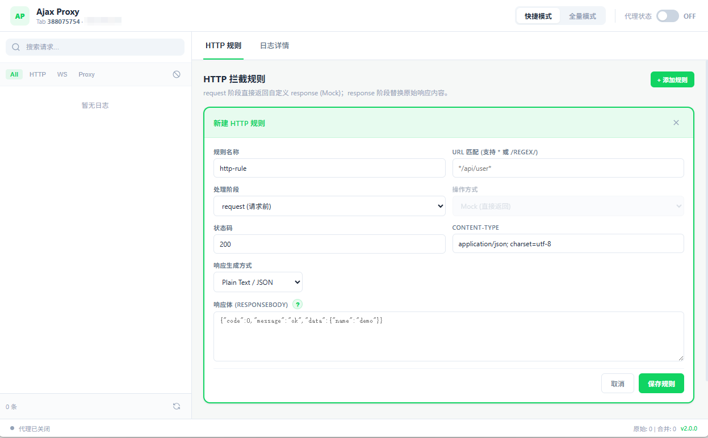
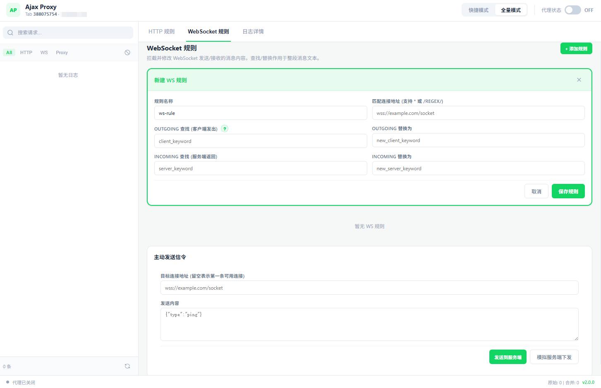

# Ajax Proxy

`Ajax Proxy` 是一个 Chrome Manifest V3 扩展，用来按标签页拦截和调试页面中的 HTTP 请求与 WebSocket 消息。它支持两种工作模式：

- `快捷模式`：低侵入，适合做接口 Mock、接口列表观察和简单代理。
- `全量模式`：基于 `chrome.debugger`，支持完整请求日志、响应改写和 WebSocket 调试。

项目当前版本见 [manifest.json](/mnt/d/work/kd_gitlab/ajax/manifest.json)。

## 功能概览

- 按标签页独立启用，不影响其他页面
- `fetch` / `XMLHttpRequest` 请求日志采集
- HTTP 请求前直接返回自定义响应
- HTTP 响应阶段整体替换或按文本查找替换
- WebSocket 收发消息拦截
- WebSocket 主动发送消息、模拟服务端下发
- 规则启停、编辑、删除
- 日志搜索、筛选、详情查看
- 规则配置持久化到 `chrome.storage`

## 界面预览

### HTTP 规则图

### WebSocket 规则图

## 工作模式

| 模式 | 实现方式 | 主要能力 | 说明 |
| --- | --- | --- | --- |
| `off` | 不注入、不挂载 debugger | 关闭代理 | 当前标签页完全透传 |
| `quick` | 页面注入 `inpage-http.js` + 部分 DNR 会话规则 | HTTP 请求前 Mock、基础日志 | 只处理 `request + fulfill` 这类 HTTP 规则，不支持 WebSocket |
| `full` | `chrome.debugger` + 页面注入 `inpage-ws.js` | 完整 HTTP 日志、响应改写、WebSocket 调试 | 浏览器会显示调试提示，这是正常现象 |

补充说明：

- `快捷模式` 下，只有 `stage=request` 且 `operation=fulfill` 的 HTTP 规则会生效。
- `全量模式` 下，HTTP 和 WebSocket 都由后台统一接管，能力最完整。

## 快速开始

### 1. 安装扩展

1. 打开 Chrome 或 Chromium 的 `chrome://extensions/`
2. 打开右上角 `开发者模式`
3. 选择 `加载已解压的扩展程序`
4. 选中当前目录

### 2. 启用代理

1. 打开目标网页
2. 点击扩展图标，打开弹窗
3. 选择 `快捷模式` 或 `全量模式`
4. 打开右上角开关
5. 点击 `打开监控面板`

### 3. 配置规则

在监控面板中可以切换：

- `HTTP 规则`
- `WebSocket 规则`
- `日志详情`

## HTTP 规则说明

### URL 匹配

`urlPattern` 支持三种方式：

- 普通包含匹配，例如 `/api/user`
- 通配符匹配，例如 `*/api/user*`
- 正则字面量，例如 `/api\/user\/\d+/i`

### 处理阶段

#### 1. `request`

在请求真正发出前直接返回自定义响应，适合做本地 Mock。

- `快捷模式` 和 `全量模式` 都支持
- 操作方式固定为 `fulfill`
- 可以自定义 `statusCode`、`contentType` 和 `responseBody`

#### 2. `response`

在拿到服务端响应后再处理，只有 `全量模式` 支持。

- `operation=fulfill`
  直接用你填写的响应体覆盖原始响应
- `operation=replace`
  先读取原始响应体，再把 `replaceFrom` 替换成 `replaceTo`

### 响应生成方式

`responseMode` 支持两种：

- `plain`
  直接把 `responseBody` 当作最终文本输出
- `mock`
  把 `responseBody` 当作 JSON 模板解析并生成动态数据

当前 Mock 模板支持的典型语法：

- `id|+1`
- `list|2-4`
- `score|1-100.1-2`
- `@guid`
- `@uuid`
- `@name`
- `@integer(1,100)`
- `@float(1,100,1,2)`
- `@pick('open','closed')`

如果 `contentType` 不是 JSON 类类型，生成后的字符串会按文本输出。

## WebSocket 规则说明

WebSocket 规则仅在 `全量模式` 生效。

### 匹配方式

`urlPattern` 与 HTTP 规则一致，也支持：

- 普通包含
- `*` 通配
- `/regex/flags`

### 处理方向

- `outgoingFind` / `outgoingReplace`
  在客户端消息真正发出前做文本替换
- `incomingFind` / `incomingReplace`
  在页面收到服务端消息前做文本替换

当前实现是纯文本替换：

- 不解析 JSON 结构
- 不支持正则替换
- 如果 `find` 为空，该方向不会做修改

### 主动发送与模拟下发

监控面板还提供两个调试动作：

- `发送到服务端`
- `模拟服务端下发`

规则目标地址留空时，会优先命中当前标签页里第一条可用的 `OPEN` 状态连接。

## 日志与调试

### 快捷模式日志

来自页面内对 `fetch` 和 `XMLHttpRequest` 的包装拦截，适合看：

- 请求地址
- 请求方法
- 请求头
- 请求体摘要
- 响应摘要

### 全量模式日志

来自 `chrome.debugger` 的 `Network` 与 `Fetch` 事件，适合看：

- 请求发起
- 响应状态
- 加载完成或失败
- WebSocket 建连、握手、收发帧
- HTTP 规则命中情况

## 代码结构

- [manifest.json](/mnt/d/work/kd_gitlab/ajax/manifest.json)
  扩展声明、权限、脚本入口
- [background.js](/mnt/d/work/kd_gitlab/ajax/background.js)
  配置存储、模式切换、日志聚合、`chrome.debugger` / DNR 管理
- [content-bridge.js](/mnt/d/work/kd_gitlab/ajax/content-bridge.js)
  页面与扩展之间的桥接层
- [inpage-http.js](/mnt/d/work/kd_gitlab/ajax/inpage-http.js)
  快捷模式下的 `fetch` / `XMLHttpRequest` 注入逻辑
- [inpage-ws.js](/mnt/d/work/kd_gitlab/ajax/inpage-ws.js)
  全量模式下的 WebSocket 包装与消息替换
- [popup.html](/mnt/d/work/kd_gitlab/ajax/popup.html)
  弹窗入口
- [popup.js](/mnt/d/work/kd_gitlab/ajax/popup.js)
  标签页状态切换、模式选择
- [monitor.html](/mnt/d/work/kd_gitlab/ajax/monitor.html)
  监控面板页面
- [monitor.js](/mnt/d/work/kd_gitlab/ajax/monitor.js)
  规则编辑、日志渲染、WS 调试交互

## 持久化与权限

### 存储

规则使用 `chrome.storage` 持久化，主键为：

- `ajax_proxy_config_v2`

### 关键权限

- `storage`
- `tabs`
- `activeTab`
- `debugger`
- `scripting`
- `declarativeNetRequest`
- `declarativeNetRequestWithHostAccess`
- `host_permissions: <all_urls>`
